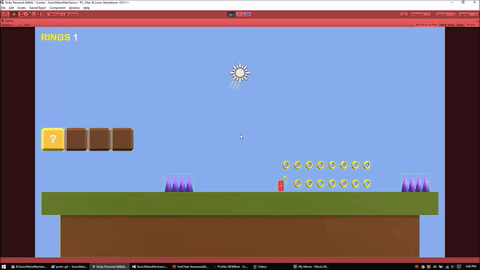
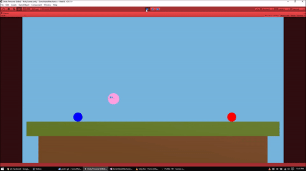

# SonicMarioMechanics

# Tutorial coming soon
A companion Unity3D project to accompany a YouTube tutorial that teaches you how to make simple iconic mechanics from the games Sonic, Mario and Kirby. This repo will have all needed assets to perform what I do in the video tutorial.
